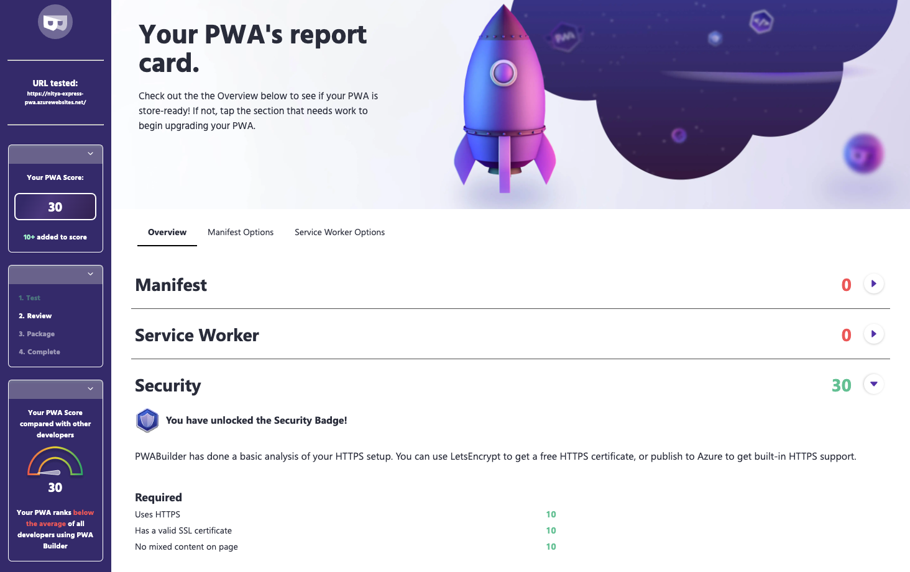

# Building a Basic PWA With Express

Let's start by [creating and deploying a basic web app to Azure](https://docs.microsoft.com/en-us/azure/app-service/quickstart-nodejs) - then [enhancing it to make it PWA ready](https://docs.microsoft.com/en-us/microsoft-edge/progressive-web-apps-chromium/how-to/). The key steps are:

 1. `Scaffold`: a basic web app using the [Express application generator](http://expressjs.com/en/starter/generator.html).
 2. `Host`: the app on [Azure App Service](https://azure.microsoft.com/en-us/services/app-service/) - use [Visual Studio Code](https://code.visualstudio.com/) to simplify this.
 3. `Audit`: PWA-readiness of app with [PWABuilder](https://pwabuilder.com) - review the recommendations.
 4. `Add PWA Support`: create manifest, add service workers - see [this tutorial](https://docs.microsoft.com/en-us/microsoft-edge/progressive-web-apps-chromium/how-to/) for help.
 5. `Audit`: run the PWABuilder audit again. _What changed?_
 6. `Test`: Integrate [Playwright](https://playwright.dev) for cross-browser testing (on desktop and mobile targets).

Ready? Let's go!


---

## 1. [Setup your Dev Environment](https://docs.microsoft.com/en-us/azure/app-service/quickstart-nodejs)

 * You need an Azure account with an active subscription. Create one [for free](https://azure.microsoft.com/free/).
 * Install Node.js and npm in your local development device. I used [NVM](https://github.com/nvm-sh/nvm)
 * Verify Node installation with `node --version` => mine is `v16.2.0`
 * Install [Visual Studio Code](https://code.visualstudio.com/) as editor => simplifies working with Azure.

---

## 2. [Scaffold Basic Web App](https://docs.microsoft.com/en-us/azure/app-service/quickstart-nodejs)

Use the `express-generator` to scaffold a basic Node.js app in the `myApp` subfolder. The following command uses [pug](https://pugjs.org/api/getting-started.html) as the view engine.

```
$ npx express-generator myApp --view pug

   create : myApp/
   create : myApp/public/
   create : myApp/public/javascripts/
   create : myApp/public/images/
   create : myApp/public/stylesheets/
   create : myApp/public/stylesheets/style.css
   create : myApp/routes/
   create : myApp/routes/index.js
   create : myApp/routes/users.js
   create : myApp/views/
   create : myApp/views/error.pug
   create : myApp/views/index.pug
   create : myApp/views/layout.pug
   create : myApp/app.js
   create : myApp/package.json
   create : myApp/bin/
   create : myApp/bin/www

   change directory:
     $ cd myApp

   install dependencies:
     $ npm install

   run the app:
     $ DEBUG=myapp:* npm start
$ 
```
---

## 3. [Build and Preview App Locally](https://docs.microsoft.com/en-us/azure/app-service/quickstart-nodejs)

Build the app and preview it locally by launching your browser to `http://localhost:3000`

```
$ cd myApp
$ npm install
$ npm start
```

The app is configured to use port 3000 by default, but you can use `DEBUG=myapp:* npm start` to get verbose output that clearly identifies the server port, if needed. Verify that you see something like this:


---

## [Deploy to Azure (from VS Code)](https://docs.microsoft.com/en-us/azure/app-service/quickstart-nodejs)

 * Open VS Code from `myApp` folder using `code .` on command line.
 * Install the [Azure App Service](https://marketplace.visualstudio.com/items?itemName=ms-azuretools.vscode-azureappservice) extension for VS Code.
 * Click the 'Azure' icon in the Activity Bar (left) - sign in.
 * You should see  your Azure email in the Status bar.
 * Click `App Service` in Azure menu - it will list all your subscriptions.
 * Select the subscription you want to target (remove others)
 * Select the "Deploy to Web App" icon (looks like cloud with up arrow)
  - Select the `myApp` folder as source
  - Choose `Create new Web App` - Linux container used by default
  - Type globally unique name for app (I used `nitya-express-pwa`)
  - Select runtime stack (I picked Node 16 LTS)
  - Select pricing tier (I picked Free)

> Now wait for Azure to finish provisioning resources..

You can see the process status in a pop-up alert (bottom right of Code). It's also worth opening [Azure Portal](https://portal.azure.com) to see if/when resources are created, and where.

 * In the popup `Always deploy the workspace "myExpressApp" to <app-name>"`, I selected Yes. Ensures that deploying from _this_ folder on VS Code will always update _that_ resource (deployed web app)
 * The "Deployment to ... completed" alert provides three options: `Browse Website`, `Stream Logs`, `Upload Settings`.
 * I chose to Browse Website. Here it is: [nitya-express-pwa](https://nitya-express-pwa.azurewebsites.net/) hosted on Azure App Service!!

---

## [Audit The App with PWABuilder](https://www.pwabuilder.com/)

This app is a basic web app with _no_ PWA enhancements built in. Let's audit it to see what the score is right now. We'll use [PWABuilder](https://www.pwabuilder.com/) and point it to our website for a report.



As expected we scored quite badly. The three _required_ features for PWA are:
 * `Security` - must use HTTPS, have a valid SSL certificate and have no mixed content on page (i.e., not be loading content from both HTTP and HTTPS targets). 
 * `Service Workers` - 